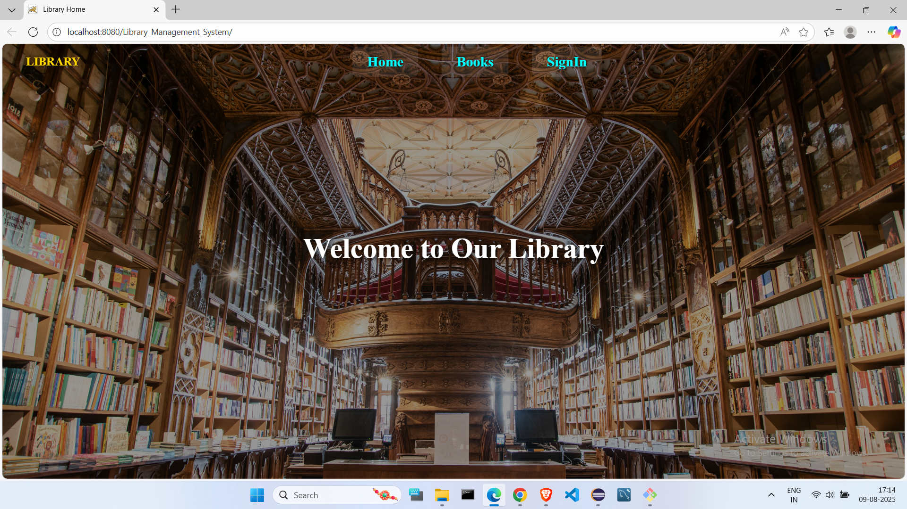
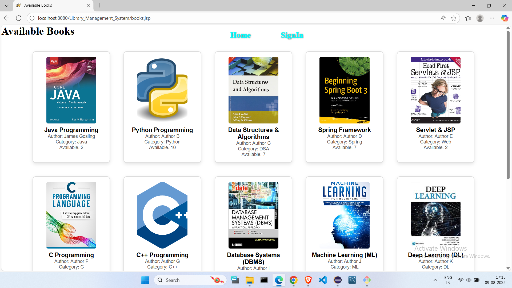

# 📚 Library Management System (LMS)

## 📖 Overview
The **Library Management System (LMS)** is a web-based application designed to manage book borrowing, user accounts, and library operations for educational institutions or personal use.  
This version is **portable**, meaning it can be deployed locally or on any server with minimal setup, and it only has **two roles**:

- **User (Student/Reader)**
- **Admin**

---

## 🎯 Objectives
- Provide a **simple, fast, and easy-to-use** interface for managing books.
- Reduce manual work for librarians.
- Allow users to easily **browse, borrow, and return** books.
- Maintain an **organized and searchable** book database.

---

## 👥 Roles & Features

### **1. User (Student/Reader)**
- **Login / Registration** → Create an account & log in securely.
- **Search Books** → Search by title, author, or category.
- **View Available Books** → See all available books with details.
- **Borrow Book** → Request to borrow available books.
- **My Borrowed Books** → View current loans and due dates.
- **Return Book** → Return borrowed books.
- **History** → View User History.
- **Profile Management** → Update personal details & password.

### **2. Admin**
- **Login** → Access admin dashboard.
- **Manage Users** → Add, update, delete users.
- **Manage Books** → Add, update, delete books in the catalog.
- **Track Borrowed Books** → See all ongoing loans and overdue returns.
- **Generate Reports** → View book activity & user statistics.
- **Manage Books Status** → Handle manual returns.
- **Fine Management** → Reduce fines if necessary.

---

## 🛠 Technology Stack
- **Frontend:** HTML, CSS, JSP  
- **Backend:** Java Servlets  
- **Database:** MySQL  
- **Server:** Apache Tomcat  
- **JDBC:** For database connectivity  

---

## 🚀 How It Works
1. **User/Admin logs in** → Role is verified from the database.  
2. **Redirect to dashboard** based on role.  
3. **User** can search, borrow, return, and view books.  
4. **Admin** can manage books, users, and approve borrow requests.  
5. **Database updates** on every transaction.  

---

## 💡 Example Workflow
1. **User** logs in → goes to **dashboard_user.jsp**.  
2. Searches for “Java Programming” → finds the book.  
3. Clicks **Borrow** → request stored in DB.  
4. **Admin** logs in → goes to **dashboard_admin.jsp** → approves request.  
5. Borrow record is updated with **due date**.  
6. User returns book before due date → no fine applied.  

---

**Note:** This project implements **session management** to ensure that no one can directly access the admin or user pages without logging in.  
Admin credentials:  
- **Username:** `admin`  
- **Password:** `admin`  

---

## 📷 Screenshots

1. **Home**  
   

2. **Books**  
   

4. **Admin Books Management**  
   

5. **Admin Fine Management**  
   

6. **Admin User Management**  
   

7. **User Profile**  
   

8. **User History Tab**  
   

9. **User Return Tab**  
   

10. **User Borrowed Books**  
    

11. **Books for User to Borrow**  
    

---

## 🧑‍💻 Author
**[Mail Me](mailto:vamsinayakbanavathu@gmail.com)** 

**[GitHub Profile](https://github.com/vamsinayak826742)**
